# HFSS使用手册

0. ## 通用设置

      1. 关于同轴线

         *为什么需要用到同轴线？*

         Kai：实际的非芯片级天线设计中，都需要用同轴线馈电。在仿真中加入同轴线，可以确保仿真设置和实际测试更接近。另外，也可以借此来消除仿真时候非理想馈电细节设置的不确定性因素，比如CPW馈电的设置。

         特征阻抗：首先需要保证同轴线的特征阻抗等于50欧姆。假设同轴线的参数如下图所示，

         

         则其特征阻抗公式为（*以后记得添加参考文献*）
         $$
         Z_{0}=\frac{138 \log _{10}\left(\frac{D_{o}}{D_{i}}\right)}{\sqrt{\varepsilon_{r}}}
         $$
         对应的计算代码如下

         ```python
         import numpy as np
         Do = 2.1 * 2
         Di = 0.6 * 2
         DK = 2.2
         z = 138 * np.log10(Do / Di) / np.sqrt(DK)
         print(z)
         ```

         上面计算中，用到了“内导体半径0.6mm，外导体半径2.1mm，绝缘层介电常数2.2”的假设（迪凡提到，微波实验中用到的同轴线参数）。

         注意：同轴内有无非空气绝缘层，特征阻抗有明显差别。

         一个小技巧：馈电同轴线的绝缘层，可以用空气，而不是真实的同轴线塑料材质。只要同轴阻抗等于50ohm即可。采用空气的话，馈电部位的网格划分更少，稍微降低一点点计算量。

      2. 馈电同轴线的结构图和建模步骤
  
         首先建立一个半径为0.6mm的圆柱体作为金属内导体，材料设置为pec,使所有金属板与其做减法并克隆，保证内导体与金属板有实际接触
         然后建立一个半径为2.1mm的圆柱体作为外导体，材料设置为Teflon
         按F切换至选择面模式，选中外导体的外表面，将其设置为perfectE
         使外导体所接的金属板/GND与其做减法并克隆，保证外导体与其有实际接触
         另外使与其内导体做减法并克隆，保证内导体部分均为理想电导体材料
         

         同轴线的建模过程很简单，分别创建内芯金属柱，外套金属桶，内外之间用vacuum隔开（也可以是其他绝缘塑料材料），确保特征阻抗等于50ohm即可。为了实现馈电，同轴线的内芯通常需要长出来一截，和天线辐射体的某点连接。同轴馈电结构和天线辐射体组合的时候，注意确保同轴的内外导体之间畅通，不被封闭，否则电磁波无法从同轴馈电出来。

         figure test

         
         


​         

         建好同轴结构之后，接下来需要给同轴馈电。有两种馈电方法，第一种是采用lumped port（**请迪凡补充一下**）
    
         *lumped port：在上述同轴线建模完成后，按F选中同轴线底面（由内导体向外导体/外导体向内导体均可）设置激励（右键->Assign excitation->lumped port），特征阻抗设置为默认值50ohm，选择new             line做一条lumped line做激励
         
    
      3. 双层空气盒子。尽量设置两层空气盒子，其中，外层盒子与天线的距离要约等于1/4中心频率波长，用于吸收电磁波（设置为辐射边界），从而模拟天线放在自由空间的情况；内层尽量接近天线，用作求解方向图时候的近场-远场变换。内边界的表面设置为一个facelist，之后计算远场的时候，选这个facelist作为近场源。
    
      4. 需要生成多个相同结构时候，善用HFSS内置的“duplicate”功能。比如，对于旋转对称的情况（圆周上快速建立均匀分布的几何体），先创建一个几何体，设置好其参数，再点击“duplicate around axis”，选择角度即可复制。
    
         *轴对称结构*
    
      5. 参数化。尽量把所有结构尺寸甚至介电常数都参数化，便于后期做调整、扫描和优化。参数命名方式，参考程序员给代码中的参数命名，建议用下划线法命名，每个变量名中，不超过两个下划线。


​         

​         

1. ## 全向辐射微带天线仿真例子（**请迪凡补充一下，需要配图**）

   1. 内容
   *天线的三视图如下所示：*
   
   
   **上图分别展示了天线的俯视图与内部过孔结构**
   该天线以圆形贴片天线为基本结构，在距圆心距离为33.25mm位置添加了19个均匀分布在圆弧上的过孔

2. ## 基本电偶极子天线的仿真

   1. 内容

3. ## 宽带E形贴片天线

### 方法一，使用内置Toolkit建模

选择Rectangular-Probe Fed

参数设置中心频率2.4GHz，外边界为Radiation

贴片尺寸X=7，Y=5

基片材料air，高度H=1.5，X=14，Y=21

馈电点位置X=0，Y=1.9

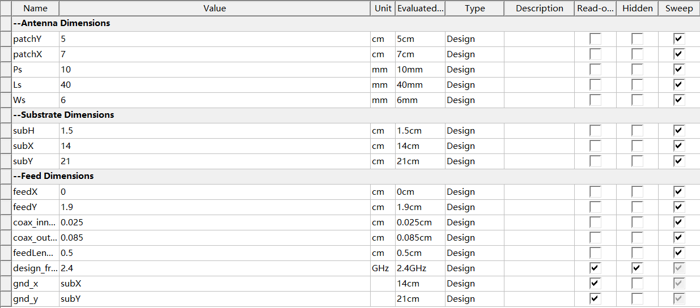

生成后在XY平面插入一个矩形

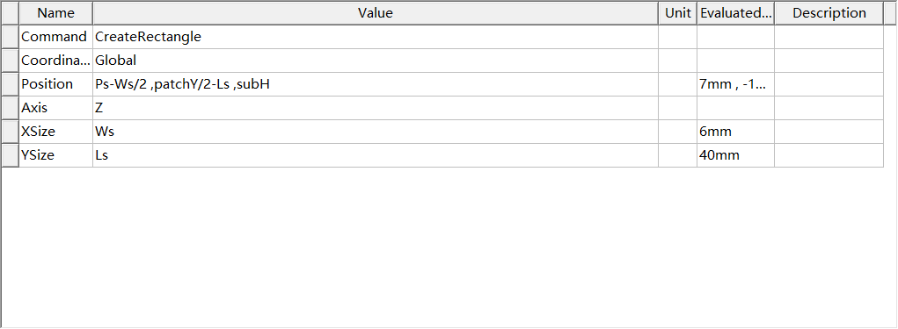

并沿y轴做镜像对称，将两个slot做Unite运算，向量设置如下

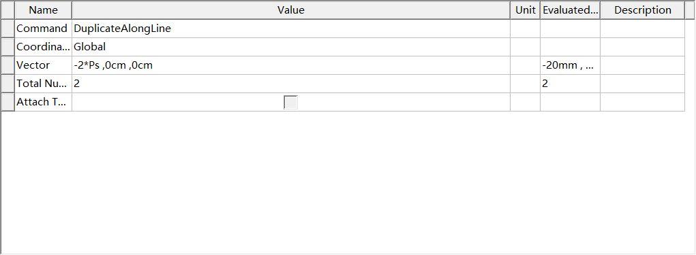

随后和贴片做Subtract运算

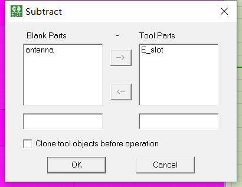

但调谐结果并不理想，遂自己重新建模。

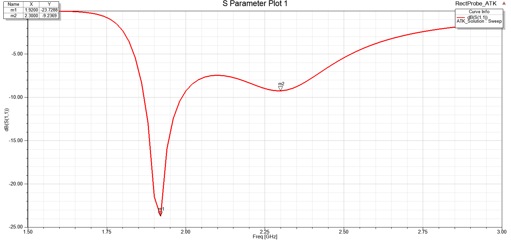

### 方法二，自己建模	

#### 新建设计工程

【HFSS】-【Solution Type】选择Modal。【Modeler】-【Units】选择mm。

#### 添加和定义设计变量

【HFSS】-【Design Properties】，按照paper内容，添加如下变量

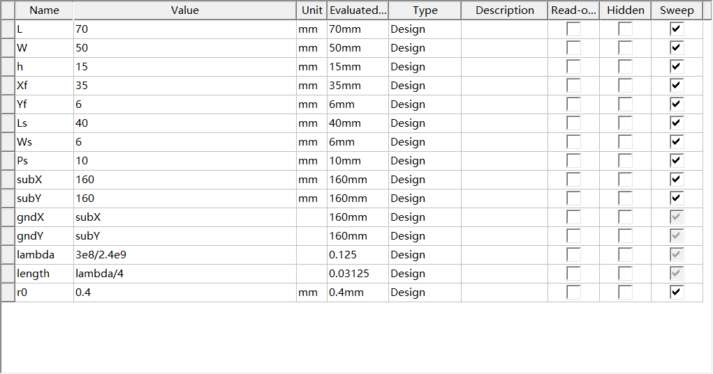

其中未提及的subX、subY为基片尺寸，gndX、gndY为地平面尺寸，lambda为2.4GHz对应波长，r0为同轴线内导体半径。注意除lambda和length外，单位均为mm！！

#### 设计建模

##### 创建介质基片

为使得坐标轴零位位于模型中心，故介质基片的顶点位置坐标为(-subX/2, -subY/2, 0)，XSize、YSize、ZSize分别为subX、subY、h。材质为air。适当调整颜色和透明度。命名为Sub_Air。

##### 创建辐射贴片

首先创建一个矩形作为贴片，命名为Patch，顶点坐标为(-L/2, -W/2, h)，XY尺寸分别为L、W。

随后创建另一个矩形作为缝隙，命名为slot，顶点坐标(Ps-Ws/2 ,W/2-Ls ,h)，XY尺寸为Ws、Ls，沿y轴做Vector=(-2*Ps ,0mm ,0mm)，Total Number=2的Mirror操作，并选中这两个缝隙做Unit运算。

选中Patch和slot做Subtract运算，Blank Parts为Patch，Tool Parts为slot，即可得到E形缝隙贴片。

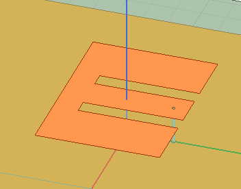

##### 创建参考地

操作同创建贴片，不过参考地应附在基片下表面。

##### 创建同轴馈线内芯

创建一个圆柱体，命名为Feed，底部圆心坐标为(0mm ,W/2-Yf ,0mm)，半径为r0（可根据实际采用的线材进行调整，此处本人选取了一个一般值），高度为h，材质设为pec（理想电导体），也可设置为copper（铜）。

##### 创建信号传输端口面

同轴馈线需要穿过参考地面来传输能量，因此需要在参考地面GND上开一个圆孔。在GND面上创建一个圆形，命名为Port，圆心坐标为(0mm ,W/2-Yf ,0mm)，半径为r0*0.23（同轴线外导体半径的基本公式，随后我找找出处..）。

选中Port和GND进行Subtract操作，Blank为GND，tool为Port，注意勾选Clone tool objects before operation复选框，即GND挖去Port对应的区域，但Port仍保留在原处。由此便创建好模型。

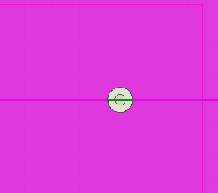

#### 设置边界条件

##### 设置理想导体边界

将Patch和GND设为理想导体边界，【Assign Boundary】-【Pefect E】。

##### 设置辐射边界条件

如果仅设置单层空气盒子，有一个快速方法，单击功能栏中的create region，勾选Pad all directions aimilarly，Padding type选择Absolute Offset，值设置为lambda/4（四分之一波长），即可根据模型的外形，自动一个各处均距离模型lambda/4的区域，选中设为辐射边界条件，【Assign Boundary】-【Radiation】。

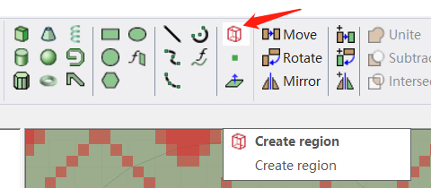

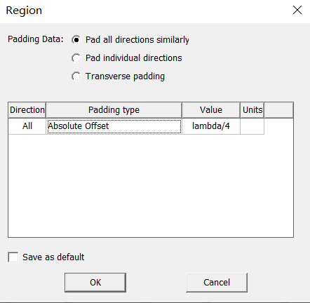

##### 设置端口激励

将端口平面Port设置集成端口激励，【Assign Excitation】-【Lumped Port】，端口阻抗设置为50ohm，在Modes对话框中选择New Line，设置积分线从同轴线内半径指向外半径（外指向内也可），鼠标显示一个小扇形即表示当前已选取到圆形的半径，选取积分线的起点和终点时均需要显示小扇形。

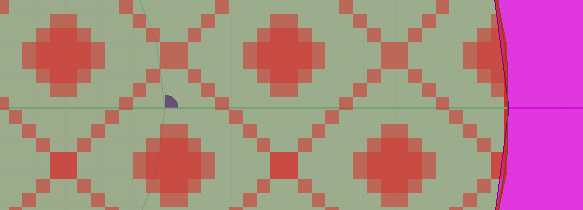

##### 求解设置

Setup1求解频率设置为2.4GHz，同时添加1.5GHz-3GHz快速扫频，具体的迭代次数、误差、步长等参数按需设置。Setup2求解频率设置为1.9GHz，同时添加1.5GHz-3GHz快速扫频。（想了想又感觉Setup2这一步也没有必要，因为原先的谐振点就在2.4GHz，1.9GHz是E形缝隙引入的）

##### 设计检查、仿真与查看仿真结果

检查设计是否正确，分别以Setup1和Setup2运行仿真计算。

查看天线的谐振频率，即查看回波损耗（S11）的扫频分析结果，Results中选择【Create Modal Solution Data Report】-【Rectangular Plot】，添加S Parameter，S（1，1），dB。注意，Context栏中选择Setup2：Sweep才能显示Setup2设置下的扫频结果。

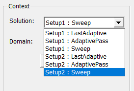

该仿真结果和文献的实测结果比较接近（略有频偏，但是偏移不多），但是和文献的计算结果相比，文献中衰减更深的谐振点在2.4GHz附近，而该仿真衰减更深的谐振点在1.9GHz附近，留给同学们思考一下（我也得思考思考..）

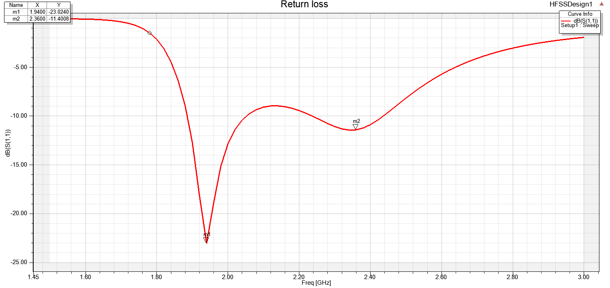

查看方向图。以下给出2.4GHz时的结果。

Radition中，E Plane：设置Phi从90到90，步长0；设置Theta从-180到180，步长1。H Plane：设置Phi从0到0，步长0；设置Theta从-180到180，步长1。（E面为yOz平面，当中主极化为Theta，交叉极化为Phi；H面为xOz平面，当中主极化为Phi，交叉极化为Theta；其实我还没有很懂怎么确定E面和H面、主极化和交叉极化，希望有同学能够讲明白...Plz。后面给出一个摸索到的方法！）

Results中，【Create Far Fields Report】-【Radiation Pattern】，添加Gain、GainPhi; GainTheta、dB。Geometry分别选择E Plane和H Plane。

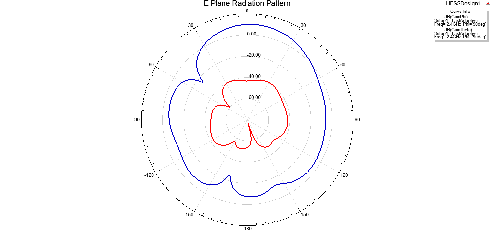

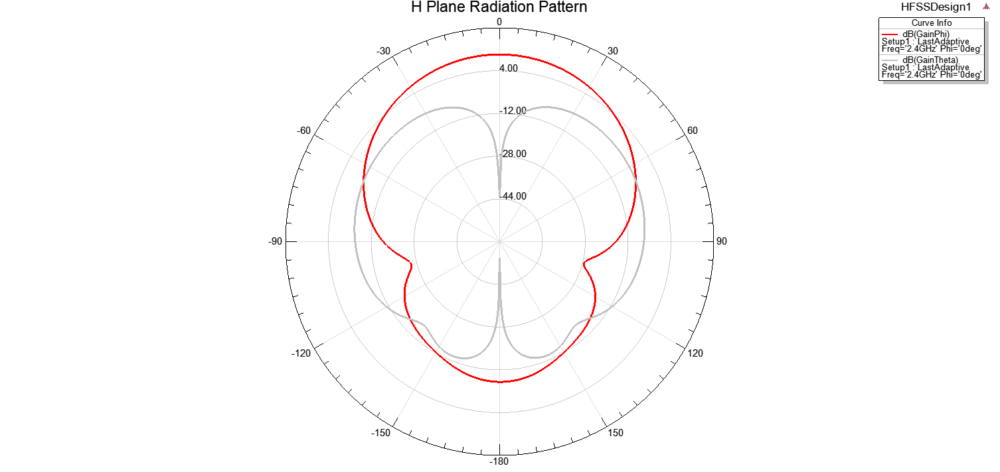

如果要添加直角坐标系方向图，则【Create Far Fields Report】-【Rectangular Plot】。和文献中的实测结果较为接近。

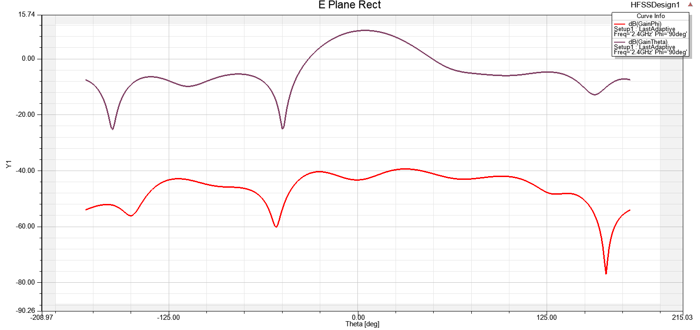

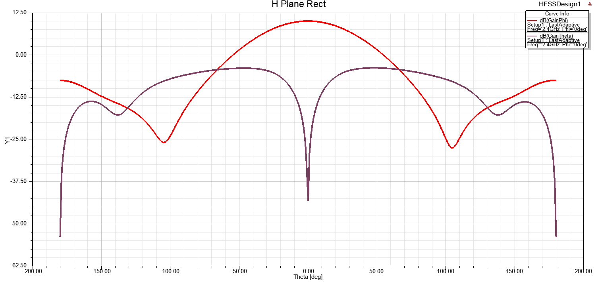

### 确定E面和H面的一个方法

#### 首先确定天线的最大辐射方向

在仿真结束后，画出天线的3D增益方向图，首先添加了一个完整的辐射球面，选择工程树下的【Radiation】-【Insert Far Field Setup】Infinite Sphere ，Phi从0～ 360，Theta从0～180，命名为3D Sphere。
然后，【Results】-【Create Far Fields Reports】-【3D Polar Plot】，确认geometry选择的是3D Shpere，Category选择Gain，Quantity选择GainTotal，Funtion选择db。

最后，根据3D增益方向图确定最大辐射方向（数值最高点与原点的连线方向），本例中最大辐射方向指向z轴正方向。

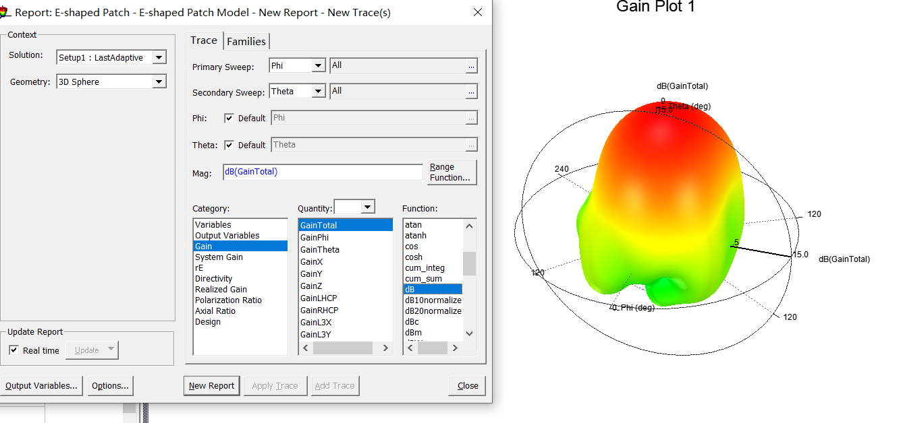

#### 确定电场和磁场方向

选中模型的天线部分后，右键【Plot Fields】-【E】-【Vector_E】，即可看到电场的方向；同样【Plot Fields】-【H】-【Vector_H】查看磁场方向。本例中的电场方向如下，可见电场合成后指向y轴负半轴。

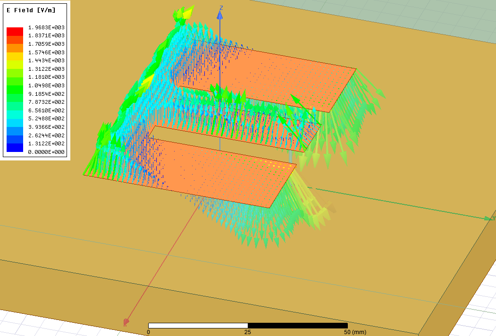

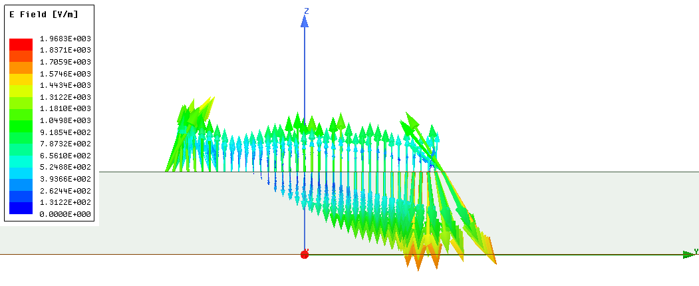

磁场方向如下。合成磁场指向x轴负半轴。

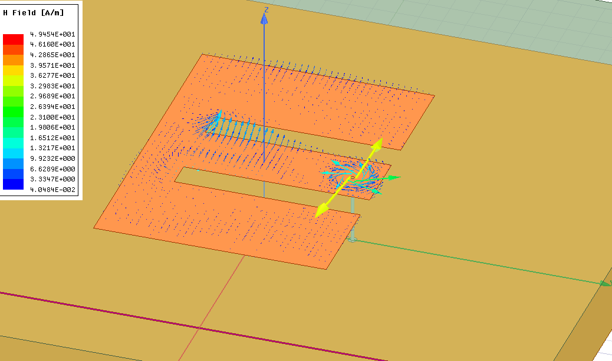

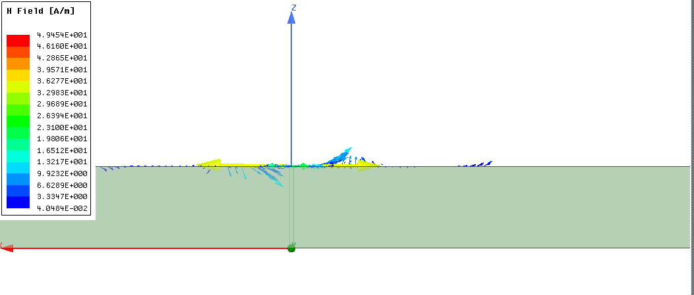

#### 确定E面和H面

过最大辐射方向和电场方向的平面即是E面，本例中最大辐射方向在z轴，电场方向在y轴，因此E面为yOz面。过最大辐射方向且与E面垂直的面即是H面，本例中磁场方向在x轴，因此H面为xOz面。

再根据球坐标系确定Phi和Theta当中哪一个取定值，哪一个取所有可能值。取值完毕后，即可绘制相应的平面方向图。


## 
### 
### 
