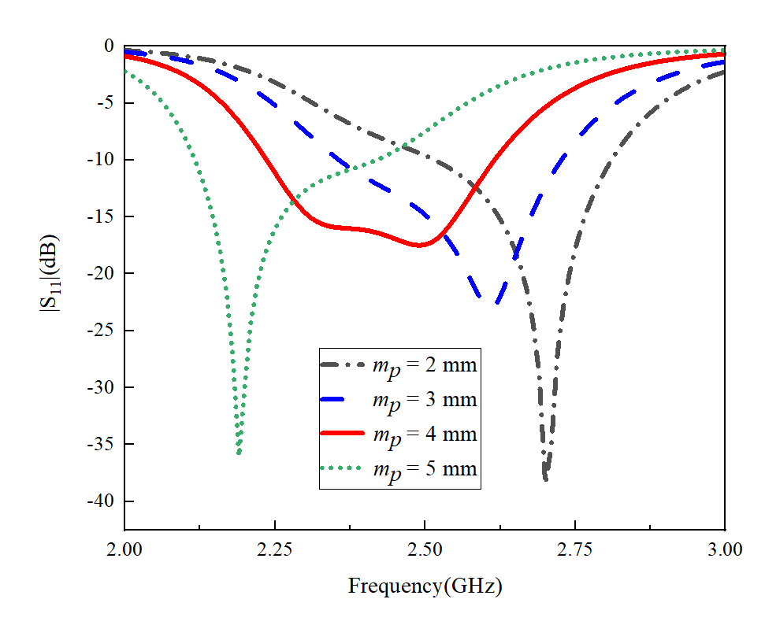
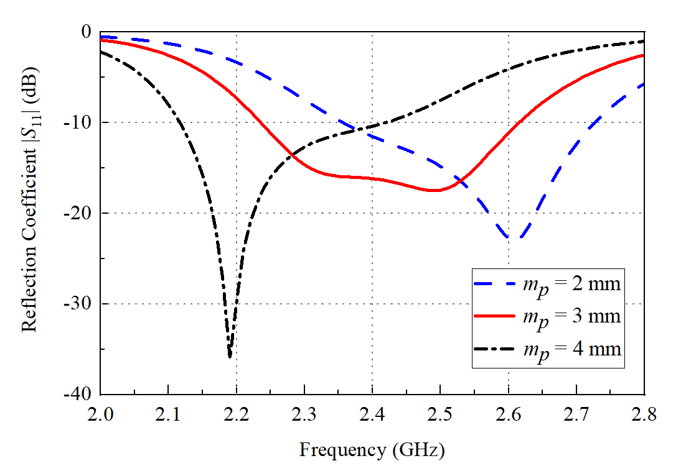
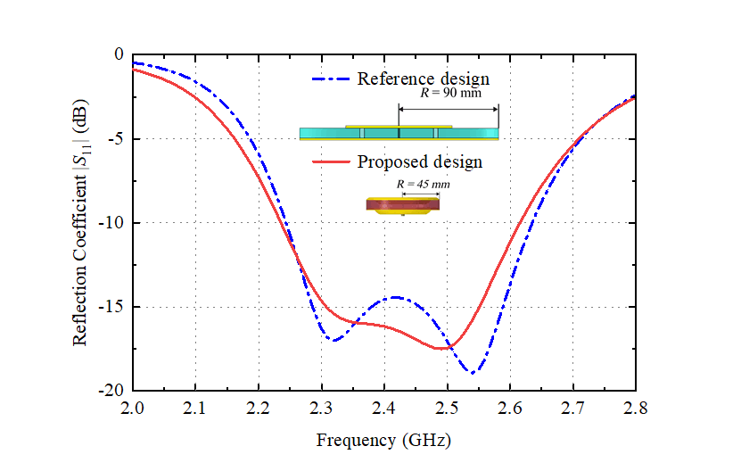
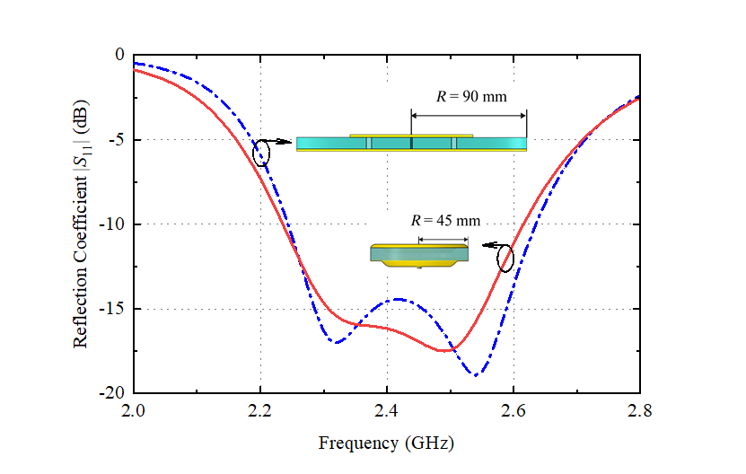
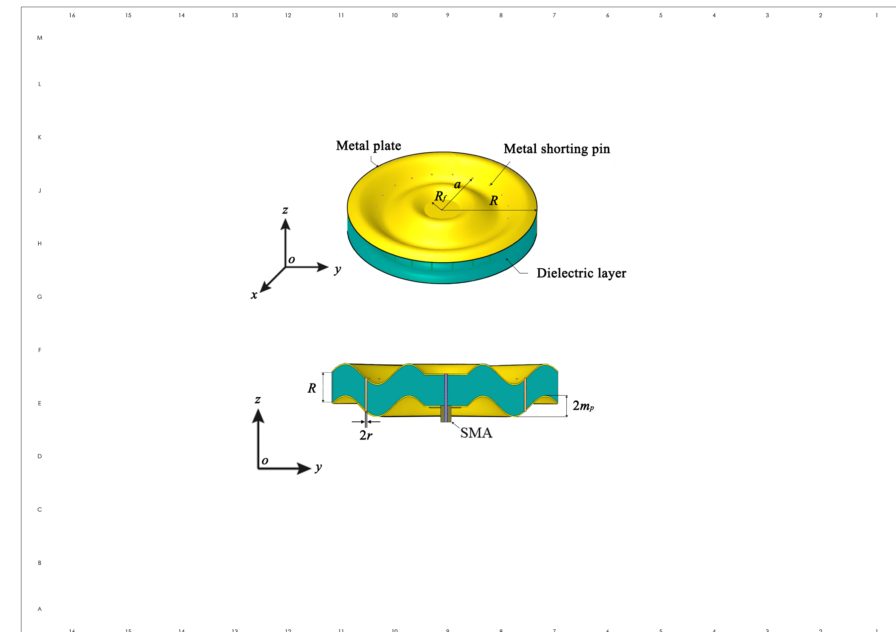

# 写作实战经验汇总

迪凡原图

杨老师对迪凡一张扫参图的意见：

1. s参数的s要斜体
2. Frequency(GHz)中间需要有空格
3. 为啥要四根扫参线，三根就能说明问题，黑线不需要
4. 红绿不要同时出现，照顾红绿色盲
5. 纵坐标可以以-40为下限，不要出现悬半空不知道多少的下限值
6. 考虑到间隔太多，纵坐标可以10 dB一大格，5 dB一小格但不标出数值
7. 横坐标的小格是多少？可以把小格个数改成4，这样就会0.05一小格；当时你是0.25一个大格子，选4个minor tick以0.05做间隔比较合适
8. 上边栏和右边栏可以加上主要网格
9. 加横竖参考线，参考线只留major tick，用点线，0.3线宽，Minor tick的参考线就不要了
10. 工作频带加色块。补充：这个扫参图，就不放色块了，之前说错了，这个是看趋势的，不是说明性能的
11. 纵坐标加上reflection coefficient
12. 改图的比例和图的尺寸，8.8厘米宽

考虑杨老师的修改意见之后，迪凡的改进图：

迪凡改图第二天实录

改之前的图：

杨老师等的改图意见：

1. 你可以把截图换成倾斜视角的。斜视图也可以给出半径。虽然我知道他在做啥，但是也看不出来这个是个啥。。。
2. 另外，字体大小不一致，正体斜体
3. 仝师兄说的也很好，两条线直接用箭头引过去也不错的。图的目的是给人看的，别人怎么快速定位到你的信息怎么来
4. 两个箭头后面的圈格式都不统一，线宽也不一样
5. 还有，箭头我比较习惯改成长度5，宽度2。默认箭头不那么好看。箭头和圈用黑色。用箭头了，就可以去掉上面线型对应的部分。

考虑部分修改意见之后的图：

杨老师说画图配色：别用正色就好，因为太刺眼；cst的默认颜色还不错，可以考虑借鉴。

连字符，短横线，长横线

输入方法：

-：减号

–：ctrl加减号

—：ctrl加alt加减号

https://zhuanlan.zhihu.com/p/162821318

三种横线的用法区别：

https://www.sohu.com/a/403023950_100051699

《一种褶皱加载的小型化全向辐射天线》论文写作经验总结：

1. 若该设计是以某篇论文中的设计改进而来，则需要注明参考设计，并且直接的说明该设计相较参考设计有什么突出优势。
2. 引言中介绍背景时，要遵循“需求先行，技术殿后”的原则，先介绍天线的优势以及在某方面的需求，再引出由此诞生了何种技术。
3. 在引用时，若文章中有必要提到人名，则中文名字的格式为：孙梅 <-> S. Mei
4. 对于引文的标注，若是右上标的引用，就需要有一个主体来“扛起”这个上标，不可以用上标作为宾语，若想作为宾语，只能将标注设置为与正文字体相同，而非小字体上标。
5. 对于论文中的图片，以下图为例：

    1）图片要色彩清晰，对比度强，所有结构及其注释都要容易辨认，字号合适
    2）图片的标题、图片中结构的名称、图片中天线的参数所用字体字号都必须统一
    3）图片要增加坐标轴，指定其放置方位
    4）若一个图片标题下有多张图，则将其取名为(a) (b)...
6. 天线圈常用的参数说明方法：

    1）约为："~"，例：该天线的工作带宽约为2.8GHz -> 该天线的工作带宽为~2.8GHz
    2) 连字符："-"，例：该天线的10dB阻抗带宽为XX -> 该天线的10-dB阻抗带宽为XX
7. 关于辐射方向图：若交叉极化的幅值很小，在图中表现为一个点，则为了直观我们可以省去交叉极化，并在文章中说明“交叉极化分量小于−XX dBi，甚至无法在图中显示”
8. 关于使用zotero管理引文的教程：https://blog.csdn.net/weixin_36302584/article/details/110876999
9. 若论文有严格的字数限制，则文章中必须要提到的部分应是设计中最突出的特点以及对应参数的选择。尽量避免摘要、引言、总结三者中的重复内容，用最简练的语言概括最大特点即可。