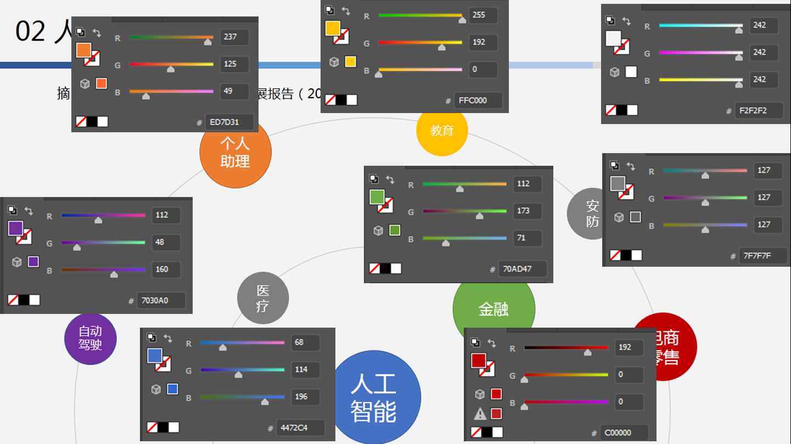

# 写作实战经验汇总

迪凡原图

杨老师对迪凡一张扫参图的意见：

1. s参数的s要斜体
2. Frequency(GHz)中间需要有空格
3. 为啥要四根扫参线，三根就能说明问题，黑线不需要
4. 红绿不要同时出现，照顾红绿色盲
5. 纵坐标可以以-40为下限，不要出现悬半空不知道多少的下限值
6. 考虑到间隔太多，纵坐标可以10 dB一大格，5 dB一小格但不标出数值
7. 横坐标的小格是多少？可以把小格个数改成4，这样就会0.05一小格；当时你是0.25一个大格子，选4个minor tick以0.05做间隔比较合适
8. 上边栏和右边栏可以加上主要网格
9. 加横竖参考线，参考线只留major tick，用点线，0.3线宽，Minor tick的参考线就不要了
10. 工作频带加色块。补充：这个扫参图，就不放色块了，之前说错了，这个是看趋势的，不是说明性能的
11. 纵坐标加上reflection coefficient
12. 改图的比例和图的尺寸，8.8厘米宽

考虑杨老师的修改意见之后，迪凡的改进图：

迪凡改图第二天实录

改之前的图：

杨老师等的改图意见：

1. 你可以把截图换成倾斜视角的。斜视图也可以给出半径。虽然我知道他在做啥，但是也看不出来这个是个啥。。。
2. 另外，字体大小不一致，正体斜体
3. 仝师兄说的也很好，两条线直接用箭头引过去也不错的。图的目的是给人看的，别人怎么快速定位到你的信息怎么来
4. 两个箭头后面的圈格式都不统一，线宽也不一样
5. 还有，箭头我比较习惯改成长度5，宽度2。默认箭头不那么好看。箭头和圈用黑色。用箭头了，就可以去掉上面线型对应的部分。

考虑部分修改意见之后的图：

杨老师说画图配色：别用正色就好，因为太刺眼；cst的默认颜色还不错，可以考虑借鉴。

